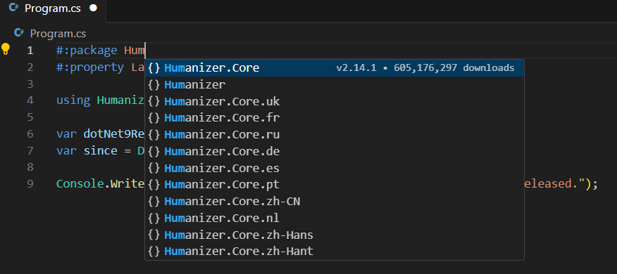

# C# Package Autocomplete

[](https://taraskovalenko.github.io/)
[](https://marketplace.visualstudio.com/items?itemName=taraskovalenko.csharp-package-autocomplete)
[](https://marketplace.visualstudio.com/items?itemName=taraskovalenko.csharp-package-autocomplete)
[](https://marketplace.visualstudio.com/items?itemName=taraskovalenko.csharp-package-autocomplete)

Supercharge your C# top-level programs with intelligent NuGet package autocomplete! This extension provides seamless autocomplete for `#:package`, `#:sdk`, `#:property` directives.
Complete IntelliSense support for .NET 10 file-based app directives in Visual Studio Code. Build and run `C#` applications directly from single `.cs` files with full autocomplete for packages, SDKs, and MSBuild properties.



## Terms of use

By using this project or its source code, for any purpose and in any shape or form, you grant your **implicit agreement** to all of the following statements:

- You unequivocally condemn Russia and its military aggression against Ukraine
- You recognize that Russia is an occupant that unlawfully invaded a sovereign state
- You agree that [Russia is a terrorist state](https://www.europarl.europa.eu/doceo/document/RC-9-2022-0482_EN.html)
- You fully support Ukraine's territorial integrity, including its claims
  over [temporarily occupied territories](https://en.wikipedia.org/wiki/Russian-occupied_territories_of_Ukraine)
- You reject false narratives perpetuated by Russian state propaganda

To learn more about the war and how you can help, [click here](https://war.ukraine.ua/). Glory to Ukraine! 🇺🇦

## ✨ Features

### 📦 **Package Management (`#:package`)**
- Type `#:package` and get instant autocomplete suggestions from the official NuGet repository
- Intelligent search with fuzzy matching for package names
- Real-time package information with descriptions and download statistics
- Version management with `@` syntax for easy version selection
- Shows latest stable versions first (excludes pre-release by default)

### 🛠️ **SDK Selection (`#:sdk`)**
- Full autocomplete for .NET SDKs including:
  - `Microsoft.NET.Sdk` - Console applications and class libraries
  - `Microsoft.NET.Sdk.Web` - ASP.NET Core applications and Web APIs
  - `Microsoft.NET.Sdk.Worker` - Background services and hosted services
  - `Microsoft.NET.Sdk.WindowsDesktop` - WPF and Windows Forms applications
  - `Microsoft.NET.Sdk.Razor` - Razor class libraries and components
  - `Microsoft.NET.Sdk.BlazorWebAssembly` - Blazor WebAssembly applications
- Rich documentation with SDK descriptions and default target frameworks

### ⚙️ **MSBuild Properties (`#:property`)**
- Intelligent autocomplete for common MSBuild properties:
  - **LangVersion** - C# language version (`latest`, `preview`, `12`, `11`, etc.)
  - **TargetFramework** - Target framework (`net10.0`, `net9.0`, `net8.0`, etc.)
  - **Nullable** - Nullable reference types (`enable`, `disable`, `warnings`, `annotations`)
  - **ImplicitUsings** - Implicit using statements (`enable`, `disable`)
  - **PublishAot** - Ahead-of-time compilation (`true`, `false`)
  - **TreatWarningsAsErrors** - Compiler warning handling
  - **WarningLevel** - Compiler warning levels (0-5)
  - And many more...
- Context-aware value suggestions with default values and descriptions

### 📖 **Rich Documentation & Hover Support**
- Comprehensive hover information for all directive types
- Package descriptions, download counts, and direct links to NuGet
- SDK explanations with use cases and target frameworks
- Property documentation with possible values and defaults
- Visual indicators for package popularity and property defaults

### ⚡ **Performance Optimized**
- Intelligent caching reduces API calls and improves response time
- Non-blocking searches don't interrupt your coding flow
- Minimal resource usage with smart request batching

## 🚀 Getting Started

### Installation

1. Install **.NET 10 Preview 4** or later from [dotnet.microsoft.com](https://dotnet.microsoft.com/download/dotnet/10.0)
2. Open **Visual Studio Code**
3. Go to Extensions (`Ctrl+Shift+X`)
4. Search for "C# File-Based App Directive Support"
5. Click "Install"

### Usage

1. **Create a C# file** with `.cs` extension
2. **Type any directive** and get autocomplete:
   ```csharp
   #:package Humanizer@2.14.1
   #:sdk Microsoft.NET.Sdk.Web
   #:property LangVersion preview
   ```
3. **Start typing** and see intelligent suggestions
4. **Run your script** with `dotnet run yourfile.cs`

## 📝 Examples

### Console Application with NuGet Package
```csharp
#:package Humanizer@2.14.1

using Humanizer;

var dotNet10Released = DateTimeOffset.Parse("2025-11-01");
var since = DateTimeOffset.Now - dotNet10Released;

Console.WriteLine($"It has been {since.Humanize()} since .NET 10 was released.");
```

### ASP.NET Core Web API
```csharp
#:sdk Microsoft.NET.Sdk.Web
#:package Microsoft.AspNetCore.OpenApi@10.*-*
#:property LangVersion preview

var builder = WebApplication.CreateBuilder();
builder.Services.AddOpenApi();

var app = builder.Build();
app.MapOpenApi();

app.MapGet("/", () => "Hello, World from .NET 10!");
app.MapGet("/time", () => new { Time = DateTime.Now, Message = "Current server time" });

app.Run();
```

### Background Worker Service
```csharp
#:sdk Microsoft.NET.Sdk.Worker
#:package Microsoft.Extensions.Hosting@8.0.1

var builder = Host.CreateApplicationBuilder(args);
builder.Services.AddHostedService<WorkerService>();

var host = builder.Build();
await host.RunAsync();

public class WorkerService : BackgroundService
{
    protected override async Task ExecuteAsync(CancellationToken stoppingToken)
    {
        while (!stoppingToken.IsCancellationRequested)
        {
            Console.WriteLine($"Worker running at: {DateTimeOffset.Now}");
            await Task.Delay(1000, stoppingToken);
        }
    }
}
```

### Advanced Configuration
```csharp
#:sdk Microsoft.NET.Sdk.Web
#:package FluentValidation@*
#:package FluentValidation.DependencyInjectionExtensions@*
#:package Serilog.AspNetCore@8.0.0
#:property LangVersion preview
#:property Nullable enable
#:property TreatWarningsAsErrors true
#:property EnablePreviewFeatures true

using FluentValidation;
using Serilog;

// Modern C# with preview features enabled
Log.Logger = new LoggerConfiguration()
    .WriteTo.Console()
    .CreateLogger();

var builder = WebApplication.CreateBuilder(args);
builder.Host.UseSerilog();
builder.Services.AddValidatorsFromAssemblyContaining<Program>();

var app = builder.Build();

app.MapPost("/user", async (CreateUserRequest request, IValidator<CreateUserRequest> validator) =>
{
    var result = await validator.ValidateAsync(request);
    return result.IsValid ? Results.Ok("User created") : Results.BadRequest(result.Errors);
});

app.Run();

public record CreateUserRequest(string Name, string Email);

public class CreateUserRequestValidator : AbstractValidator<CreateUserRequest>
{
    public CreateUserRequestValidator()
    {
        RuleFor(x => x.Name).NotEmpty().MaximumLength(100);
        RuleFor(x => x.Email).NotEmpty().EmailAddress();
    }
}
```

## 🎯 Directive Reference

### `#:package` - NuGet Package References
```csharp
#:package PackageName@Version
#:package Newtonsoft.Json@13.0.3
#:package Microsoft.Extensions.Hosting@8.*
```

### `#:sdk` - SDK Selection
```csharp
#:sdk Microsoft.NET.Sdk              // Console/Library (default)
#:sdk Microsoft.NET.Sdk.Web          // ASP.NET Core
#:sdk Microsoft.NET.Sdk.Worker       // Background Services
#:sdk Microsoft.NET.Sdk.WindowsDesktop  // WPF/WinForms
```

### `#:property` - MSBuild Properties
```csharp
#:property LangVersion preview        // C# language version
#:property TargetFramework net10.0    // Target framework
#:property Nullable enable            // Nullable reference types
#:property ImplicitUsings enable      // Implicit usings
#:property PublishAot true           // AOT compilation
```

## ⚙️ Configuration

No configuration needed! The extension works out of the box with sensible defaults.

### Optional Settings

Future versions may include these customizable settings:

- Cache duration for package searches
- Number of suggestions to display
- Include/exclude pre-release packages
- Custom package source URLs
- Additional MSBuild properties

## 🔧 Requirements

- **Visual Studio Code** 1.103.0 or higher
- **.NET 10 Preview 4** or later with file-based app support
- **C# Dev Kit extension** (recommended) for best experience
- **Internet connection** for package search (cached results work offline)

### VS Code Setup for File-Based Apps

1. Install the **C# Dev Kit** extension
2. Switch to **Pre-Release version** of the C# extension (version 2.79.8+)
3. Ensure you have **.NET 10 Preview 4** installed

## 🐛 Known Issues

- **Network dependency**: Requires internet connection for initial package searches
- **API rate limits**: Heavy usage might temporarily reduce suggestion speed
- **Case sensitivity**: Package names are case-sensitive in NuGet
- **SDK validation**: Some custom SDKs may not be recognized for autocomplete

## 📋 Roadmap

### Short Term
- [ ] **Custom package sources** - Support for private NuGet feeds and Azure Artifacts
- [ ] **Enhanced property validation** - Real-time validation of property values
- [ ] **Project conversion hints** - Suggestions for converting to full projects

### Long Term
- [ ] **Dependency visualization** - Show package dependency trees
- [ ] **Version comparison** - Compare versions with changelogs
- [ ] **Package templates** - Quick scaffolding for common scenarios
- [ ] **Offline mode** - Enhanced offline package suggestions
- [ ] **Multi-file support** - Support for file-based apps with multiple files
- [ ] **Debug support** - Enhanced debugging experience for file-based apps

## 🤝 Contributing

We welcome contributions! Here's how you can help:

1. **Report bugs** by creating issues on GitHub
2. **Request features** through GitHub discussions
3. **Submit pull requests** for bug fixes or new features
4. **Share feedback** and rate the extension
5. **Add SDK or property definitions** for better autocomplete coverage

### Development Setup

```bash
# Clone the repository
git clone https://github.com/TarasKovalenko/csharp-filebased-directive-support

# Install dependencies
npm ci

# Compile TypeScript
npm run compile

# Run tests
npm test

# Package extension
npm run package
```

### Testing File-Based Apps

Create test files and run them:

```bash
# Create a test file
echo '#:package Humanizer@2.14.1
using Humanizer;
Console.WriteLine("Hello".Humanize());' > test.cs

# Run with .NET 10
dotnet run test.cs

# Convert to project when ready
dotnet project convert test.cs
```

## 📄 License

This project is licensed under the MIT License - see the [LICENSE](LICENSE) file for details.

## 💝 Support

If you find this extension helpful:

- ⭐ **Star the repository** on GitHub
- 📝 **Leave a review** on the VS Code Marketplace
- 🐦 **Share it** with your fellow developers
- 💬 **Join discussions** about .NET 10 file-based apps

## 🙏 Acknowledgments

- **Microsoft .NET Team** for the innovative file-based apps feature in .NET 10
- **NuGet team** for the comprehensive package API
- **VS Code team** for the excellent extension platform
- **C# Dev Kit team** for the enhanced C# experience
- **Community** for feedback, bug reports, and feature requests

---

**Transform your C# development with single-file simplicity!** 🚀

*Made with ❤️ for the .NET community*

## 🔗 Related Links

- [.NET 10 File-Based Apps Documentation](https://docs.microsoft.com/en-us/dotnet/core/tutorials/file-based-apps)
- [.NET 10 Preview Downloads](https://dotnet.microsoft.com/download/dotnet/10.0)
- [C# Dev Kit Extension](https://marketplace.visualstudio.com/items?itemName=ms-dotnettools.csdevkit)
- [MSBuild Property Reference](https://docs.microsoft.com/en-us/dotnet/core/project-sdk/msbuild-props)